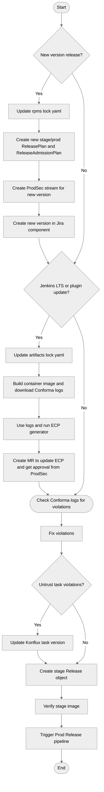

```mermaid
%%{init: {'theme': 'neutral'}}%%
flowchart TD
  Start([Start]) --> CheckNew{New version release?}

  %% New version
  CheckNew -- Yes --> UpdateRPMs[Update rpms lock yaml]
  UpdateRPMs --> CreatePlans[Create new stage/prod ReleasePlan and ReleaseAdmissionPlan]
  CreatePlans --> CreateProdsec[Create ProdSec stream for new version]
  CreateProdsec --> CreateVersion[Create new version in Jira component]
  CreateVersion --> CheckLTS

  %% No new version
  CheckNew -- No --> CheckLTS

  %% LTS/plugin update
  CheckLTS{Jenkins LTS or plugin update?}
  CheckLTS -- Yes --> UpdateArtifacts[Update artifacts lock yaml]
  UpdateArtifacts --> BuildImage[Build container image and download Conforma logs]
  BuildImage --> RunECPGen[Use logs and run ECP generator]
  RunECPGen --> ECPMR[Create MR to update ECP and get approval from ProdSec]
  ECPMR --> CheckConforma

  CheckLTS -- No --> CheckConforma

  %% Conforma
  CheckConforma([Check Conforma logs for violations]) --> FixViolations[Fix violations]
  FixViolations --> CheckUntrust{Untrust task violations?}

  CheckUntrust -- Yes --> UpdateTask[Update Konflux task version]
  UpdateTask --> CreateStage

  CheckUntrust -- No --> CreateStage

  %% Final steps
  CreateStage[Create stage Release object] --> VerifyImage[Verify stage image]
  VerifyImage --> CreateProd[Trigger Prod Release pipeline]
  CreateProd --> End([End])

  %% Clickable links
  click UpdateRPMs "https://github.com/openshift/jenkins/pull/2115"
  click CreatePlans "https://gitlab.cee.redhat.com/releng/konflux-release-data/-/merge_requests/12714"
  click CreateProdsec "https://gitlab.cee.redhat.com/prodsec/product-definitions/-/merge_requests/4201"
  click CreateVersion "https://issues.redhat.com/projects/OCPTOOLS"
  click ECPMR "https://gitlab.cee.redhat.com/releng/konflux-release-data/-/merge_requests/12729"
  click UpdateArtifacts "https://github.com/openshift/jenkins/pull/2112"
  click UpdateTask "https://github.com/openshift/jenkins/pull/2114"
  click RunECPGen "https://github.com/openshift/jenkins/blob/release-rhel8/tools/knflx-ecp-gen/README.md"
```
