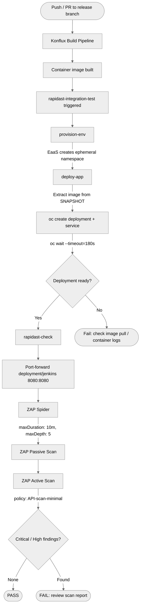

# RapiDAST Integration for OpenShift Jenkins

Dynamic Application Security Testing (DAST) for the OpenShift Jenkins container images, powered by [RapiDAST](https://github.com/redhatproductsecurity/rapidast) and OWASP ZAP within the Konflux CI/CD pipeline.

Tracked under [JKNS-1056](https://redhat.atlassian.net/browse/JKNS-1056).

## How It Works

DAST runs as a Konflux **integration test** after a successful container image build. The pipeline:

1. **Provisions** an ephemeral OpenShift namespace via EaaS (Environment as a Service)
2. **Deploys** the built Jenkins image as a `Deployment` + `ClusterIP` Service on port 8080
3. **Port-forwards** to the deployment and runs the RapiDAST/ZAP scanner against `http://127.0.0.1:8080`
4. **Reports** passive and active scan results back to the Konflux pipeline



## File Layout

| File | Purpose |
|------|---------|
| `.tekton/rapidast-integration-test.yaml` | DAST integration test pipeline definition |
| `.tekton/jenkins-rhel9-push.yaml` | Build PipelineRun triggered on push to `release-rhel9` |
| `.tekton/jenkins-rhel9-pull-request.yaml` | Build PipelineRun triggered on PRs to `release-rhel9` |

The push/pull-request PipelineRuns trigger the **build pipeline** only. Once a build succeeds, Konflux automatically runs registered integration tests — including `rapidast-integration-test` — as a separate step. The DAST pipeline is not referenced from the build PipelineRuns; the association is configured in the Konflux tenant (see [Tenant Configuration](#tenant-configuration)).

## Pipeline Configuration

### `.tekton/rapidast-integration-test.yaml`

The pipeline has three tasks:

#### 1. `provision-env`

Uses the `eaas-provision-space` task to create a temporary namespace.

#### 2. `deploy-app`

Extracts the image from the Konflux `SNAPSHOT` parameter and deploys it:

```bash
IMAGE=$(echo "$SNAPSHOT" | jq -r '.components[] | select(.name == "jenkins-rhel9") | .containerImage')
oc create deployment jenkins --image=$IMAGE
oc create service clusterip jenkins --tcp=8080:8080
oc wait --for=condition=Available=true deployment/jenkins --timeout=180s
```

The `.name` selector in the `jq` expression must match the Konflux component name (`jenkins-rhel9`).

#### 3. `rapidast-check`

Fetches the scanner task from the RapiDAST repo at a pinned version:

```yaml
taskRef:
  resolver: git
  params:
    - name: url
      value: https://github.com/redhatproductsecurity/rapidast
    - name: revision
      value: "2.13.0"
    - name: pathInRepo
      value: examples/konflux/rapidast-check.yaml
```

Scanner config is inlined via `RAPIDAST_CONFIG_VALUE`:

```yaml
config:
  configVersion: 6
application:
  shortName: "jenkins-dast-scan"
  url: http://127.0.0.1:8080
scanners:
  zap:
    authentication:
      type: http_header
      parameters:
        name: "Authorization"
        value: "Basic YWRtaW46cGFzc3dvcmQ="   # admin:password (base64)
    spider:
      maxDuration: 10    # minutes
      maxDepth: 5
    passiveScan: {}
    activeScan:
      policy: API-scan-minimal
```

Key parameters:
- `KUBECONFIG_SECRET` - references the ephemeral namespace kubeconfig
- `PORT_FORWARD_TARGETS` - `deployment/jenkins 8080:8080` routes scanner traffic to the pod

## Tenant Configuration

DAST must be enabled in the Konflux release tenant (`konflux-release-data`). The component needs a configuration entry that associates the `rapidast-integration-test` pipeline with it.

This is done externally in the [konflux-release-data](https://gitlab.cee.redhat.com/releng/konflux-release-data) repo, not in this repository.

## Updating the RapiDAST Version

To consume a new RapiDAST release:

1. Update the `revision` field in the `rapidast-check` task:
   ```yaml
   - name: revision
     value: "2.13.0"  # change to new version
   ```
2. Check the [RapiDAST releases](https://github.com/redhatproductsecurity/rapidast/releases) for breaking changes in `examples/konflux/rapidast-check.yaml`
3. Submit a PR targeting the release branch

## Validating Changes

Use a **Draft PR** to validate DAST pipeline changes without merging:

1. Push your branch and open a Draft PR against the release branch
2. The Konflux build pipeline triggers on the PR
3. After build completes, the `rapidast-integration-test` integration test runs
4. Monitor via the Konflux UI or `tkn` CLI
5. Close the Draft PR once validated

### What to Check

- `provision-env` task completes (namespace created)
- `deploy-app` task: image extracted correctly, deployment becomes `Available`
- `rapidast-check` task: scanner runs, scan report generated
- No Critical or High findings in the report

## Monitoring and Logs

During pipeline execution:

```
provision-env  -> Check: namespace provisioned, secretRef populated
deploy-app     -> Check: pod running, oc wait succeeds
rapidast-check -> Check: port-forward established, ZAP scan completes
```

If `deploy-app` hangs, check:
- Is the image pullable? (quay.io auth, image tag exists)
- Does the container start? (`oc logs deployment/jenkins`)
- Readiness probe timeout (default 180s)

If `rapidast-check` fails, check:
- Port-forward target matches deployment name and port
- RapiDAST version is valid (tag exists in upstream repo)
- ZAP config syntax (YAML indentation in `RAPIDAST_CONFIG_VALUE`)

## Scan Results Reference

From the initial validation (JKNS-1072, JKNS-1073):

| Metric | RHEL9 |
|--------|-------|
| URLs scanned | ~294-318 |
| Critical/High | 0 |
| Medium | 2 (CSP header, server version) |
| Low/Info | 6 |
| Active scan (SQLi, XSS, RCE, CSRF, etc.) | All PASS |
| Scan duration | ~39s |

### Known Findings (not vulnerabilities)

| Risk | Finding | ZAP Rule | Notes |
|------|---------|----------|-------|
| Medium | CSP Header Not Set | 10038 | Set via Jenkins config or ingress/route |
| Medium | Missing Anti-clickjacking Header | 10020 | Add `X-Frame-Options: DENY` |
| Low | Server Version Leak | 10036 | Strip at reverse proxy |
| Low | Content-Type Missing on error | 10019 | `/api/xml` returns 500 without Content-Type |
| Info | Auth Credentials Captured | 10105 | Expected; ZAP logging its own Basic auth header |
| Info | Suspicious Comments in JS | 10027 | Debug/TODO in Jenkins JS; not actionable |

## Troubleshooting

| Problem | Cause | Fix |
|---------|-------|-----|
| `jq` returns null for IMAGE | Component name mismatch in `.components[] \| select(.name == "...")` | Match the `.name` to the Konflux component name exactly |
| deploy-app timeout | Image pull failure or crash loop | Check image URL in SNAPSHOT, verify quay.io credentials |
| rapidast-check fails to start | Wrong RapiDAST version tag | Verify tag exists at `github.com/redhatproductsecurity/rapidast` |
| Port-forward connection refused | Deployment not ready or wrong port | Ensure service is `8080:8080` and deployment name is `jenkins` |
| DAST not triggering | Component not configured in tenant | Add integration test config in `konflux-release-data` |
| Scan returns zero URLs | Auth failing; Jenkins redirecting to login | Verify Basic auth base64 value in `RAPIDAST_CONFIG_VALUE` |

## Onboarding a New Component

To add DAST for a new Jenkins component (e.g., a new RHEL version or agent image):

1. **Create pipeline file**: Copy `.tekton/rapidast-integration-test.yaml` and update the `jq` selector to match the new component name
2. **Tenant config**: Add the integration test entry in `konflux-release-data` for the new component
3. **Validate**: Open a Draft PR to trigger the pipeline and confirm scans pass
4. **Monitor**: Check all three tasks complete successfully

## Linked PRs and MRs

### GitHub PRs (openshift/jenkins)

| PR | Title | Purpose |
|----|-------|---------|
| [#2359](https://github.com/openshift/jenkins/pull/2359) | JKNS-1056: Enable DAST on OpenShift Jenkins | Initial PR — added `.tekton/rapidast-integration-test.yaml` on the `release-rhel9` branch |
| [#2362](https://github.com/openshift/jenkins/pull/2362) | JKNS-1056: Fix $IMAGE env | Fixed image extraction from SNAPSHOT — changed `jq` to iterate `.components[]` with `select(.name)` instead of indexing by array position |
| [#2366](https://github.com/openshift/jenkins/pull/2366) | JKNS-1070: Consume rapidast@2.13.0 | Pinned `rapidast-check` task to the `2.13.0` release tag instead of following `main` |
| [#2361](https://github.com/openshift/jenkins/pull/2361) | JKNS-1071: Draft PR for RHEL9 DAST validation | Throwaway PR to trigger the Konflux pipeline and validate the DAST scan end-to-end (closed, not merged) |

### GitLab MRs (konflux-release-data)

| MR | Title |
|----|-------|
| [!18071](https://gitlab.cee.redhat.com/releng/konflux-release-data/-/merge_requests/18071) | Enable DAST on OpenShift Jenkins RHEL9 |
| [!18099](https://gitlab.cee.redhat.com/releng/konflux-release-data/-/merge_requests/18099) | Use component context for Rapidast |
| [!18111](https://gitlab.cee.redhat.com/releng/konflux-release-data/-/merge_requests/18111) | Fix component name of context |

### DAST Tenant Configuration

DAST is registered in the [konflux-release-data](https://gitlab.cee.redhat.com/releng/konflux-release-data) repo as an `IntegrationTestScenario` custom resource, under the tenant's test-scenarios directory:

```
tenants-config/cluster/stone-prd-rh01/tenants/ocp-tools-jenkins-tenant/
  openshift-jenkins-rhel9/test-scenarios/
    kustomization.yaml              # lists rapidast-integration-test.yaml as a resource
    rapidast-integration-test.yaml  # IntegrationTestScenario CR
```

Kustomize auto-generates the final CRs into `tenants-config/auto-generated/`.

The `IntegrationTestScenario` CR tells Konflux which pipeline to run, where to find it, and which component triggers it:

```yaml
apiVersion: appstudio.redhat.com/v1beta2
kind: IntegrationTestScenario
metadata:
  labels:
    test.appstudio.openshift.io/optional: "true"
  name: rapidast-openshift-jenkins-rhel9
  namespace: ocp-tools-jenkins-tenant
spec:
  application: openshift-jenkins-rhel9
  contexts:
    - description: Rapidast integration test for jenkins-rhel9 component
      name: component_jenkins-rhel9
  resolverRef:
    params:
      - name: url
        value: https://github.com/openshift/jenkins
      - name: revision
        value: release-rhel9
      - name: pathInRepo
        value: .tekton/rapidast-integration-test.yaml
    resolver: git
```

Key fields:

- **`test.appstudio.openshift.io/optional: "true"`** — marks DAST as optional; a scan failure will not block the release pipeline
- **`spec.application`** — the Konflux application name (e.g., `openshift-jenkins-rhel9`)
- **`spec.contexts[].name`** — scopes when the test runs. Must use the format `component_<component-name>` to restrict DAST to a specific component's builds. Using `application` instead would run DAST for every component in the application (including `jenkins-agent-base`), which is not desired. The component name is visible in the `appstudio.openshift.io/component` label on PipelineRuns
- **`spec.resolverRef`** — points to the pipeline YAML in this repo via the `git` resolver, pinned to the release branch

#### Application vs. Component Names

The `contexts.name` field must reference the **component** name, not the application name. These are different in Konflux:

| Application | Component | Context name |
|-------------|-----------|-------------|
| `openshift-jenkins-rhel9` | `jenkins-rhel9` | `component_jenkins-rhel9` |

See [Choosing Integration Test Contexts](https://konflux.pages.redhat.com/docs/users/testing/integration/choosing-contexts.html) for full documentation on context scoping.

## Related Issues

| Issue | Summary |
|-------|---------|
| [JKNS-1056](https://redhat.atlassian.net/browse/JKNS-1056) | Enable DAST on OpenShift Jenkins (Epic) |
| [JKNS-1068](https://redhat.atlassian.net/browse/JKNS-1068) | Configure DAST for jenkins el8 & el9 only |
| [JKNS-1069](https://redhat.atlassian.net/browse/JKNS-1069) | Add release tenant config for RHEL8/RHEL9 |
| [JKNS-1070](https://redhat.atlassian.net/browse/JKNS-1070) | Add DAST pipeline config files to repo |
| [JKNS-1071](https://redhat.atlassian.net/browse/JKNS-1071) | Create Draft PR for validation |
| [JKNS-1072](https://redhat.atlassian.net/browse/JKNS-1072) | Monitor DAST pipeline execution |
| [JKNS-1073](https://redhat.atlassian.net/browse/JKNS-1073) | Verify DAST reports and results |
| [JKNS-1074](https://redhat.atlassian.net/browse/JKNS-1074) | Document reusable DAST onboarding workflow |
